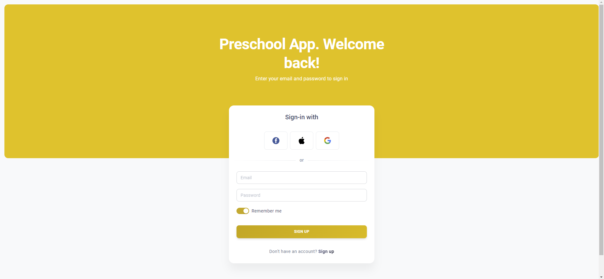
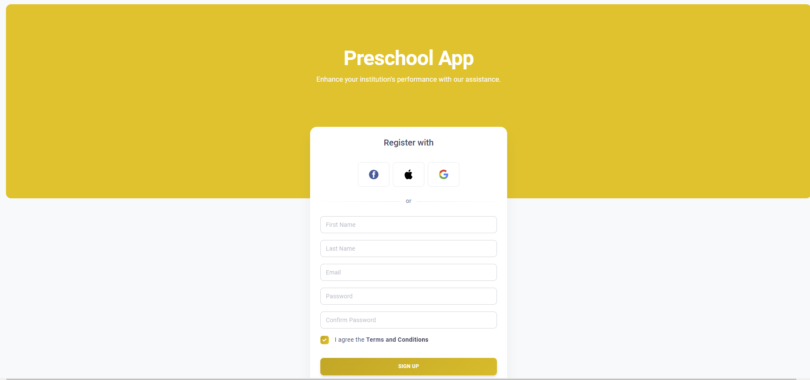
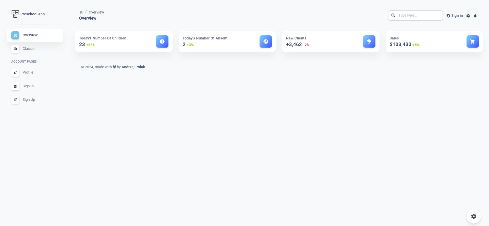
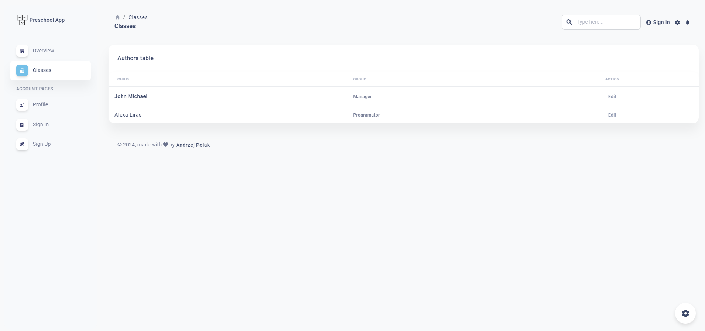
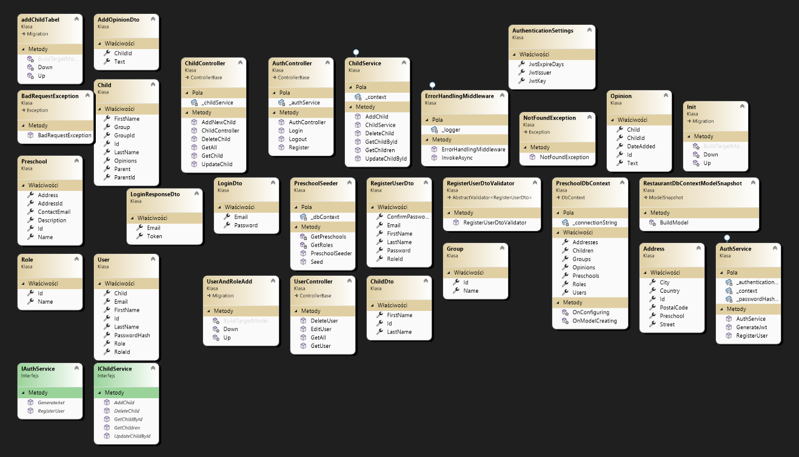
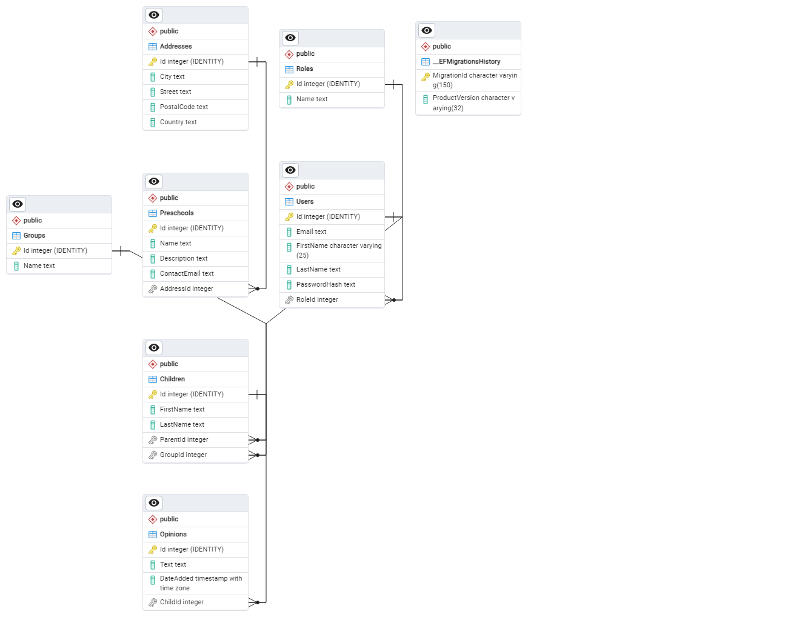

# Preschool Pro

Application for preschool management written in React + TS (frontend) and .NET Core (backend).

## Table of Contents

- [Introduction](#introduction)
- [Features](#features)
- [Requirements](#requirements)
- [Installation](#installation)
- [Running](#running)
- [Usage](#usage)
- [Contributing](#contributing)
- [License](#license)

## Introduction

An application for managing a kindergarten, which allows for efficient transmission of feedback about a specific child and facilitates easy communication with the parents of the children.

## Features

 - Attendance Management: Digital check-in and check-out system for tracking attendance and ensuring children's safety.
 - Parent-Teacher Communication: A secure messaging platform that enables direct and group communication between parents and teachers.
 - User-Friendly Interface: An intuitive and easy-to-navigate design suitable for all users regardless of their tech-savviness.
 - Customizable Notifications: Allowing parents and teachers to set and receive notifications according to their preferences.
 - Parental Involvement Opportunities: Information on how parents can get involved in various kindergarten activities and events.

### Application views

## Requirements

- List all the requirements needed to run the project (e.g., environment, dependencies, etc.).

## Installation

Describe how to install and configure the project in a local environment.

